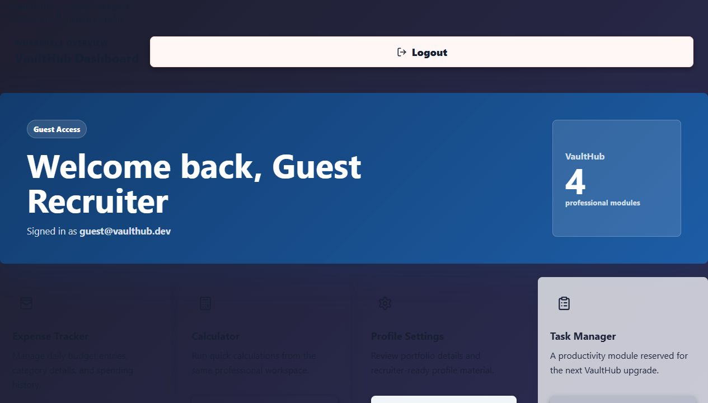
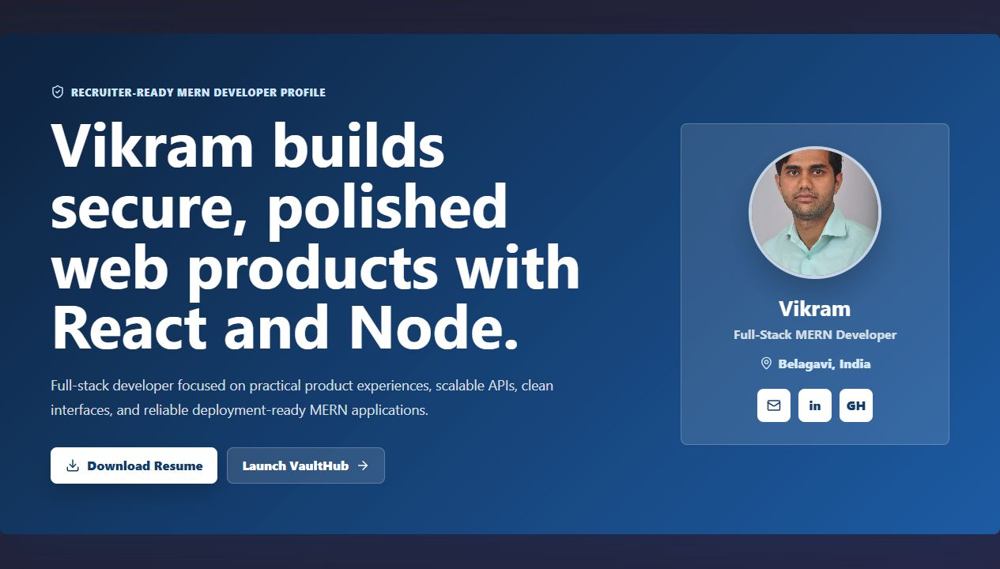

# VaultHub

VaultHub is a MERN portfolio workspace for Vikram C. Nilaji. It combines a recruiter-ready profile, resume download, live project links, secure authentication, an expense tracker, and productivity modules in one React application.

## Live Demo

- Portfolio: https://vikramsvaulthub-theta.vercel.app/
- Voice of Venugram: https://www.voiceofvenugram.com
- Backend API: https://vaulthub-xm1r.onrender.com

## Features

- Recruiter-focused profile with resume PDF download
- Direct project links for Voice of Venugram and Vault Hub
- Login, signup, and guest access flows
- JWT-protected dashboard
- Expense tracker with add, list, edit, delete, and total views
- Calculator module
- Responsive layouts for desktop, tablet, and mobile

## Tech Stack

- Frontend: React, Vite, React Router, CSS, lucide-react
- Backend: Node.js, Express.js, MongoDB, Mongoose
- Authentication: JWT, bcrypt
- Tools and deployment: GitHub, Render, Vercel, Postman

## Screenshots





## Local Setup

Install frontend dependencies:

```bash
npm install
```

Start the frontend:

```bash
npm run dev
```

Build for production:

```bash
npm run build
```

Run lint checks:

```bash
npm run lint
```

## Backend Setup

From `auth-portal/backend`:

```bash
npm install
npm run dev
```

Required backend environment variables:

```bash
MONGO_URI=your_mongodb_connection_string
JWT_SECRET=your_jwt_secret
PORT=5000
```

## API Documentation

Backend routes are documented in [`../../docs/API.md`](../../docs/API.md).

## Notes

- `public/Resume.pdf` is the resume file used by the profile download button.
- Update `githubProfileUrl` in `src/components/ProfilePage/Profile.jsx` with the exact GitHub profile URL before sharing with recruiters.
